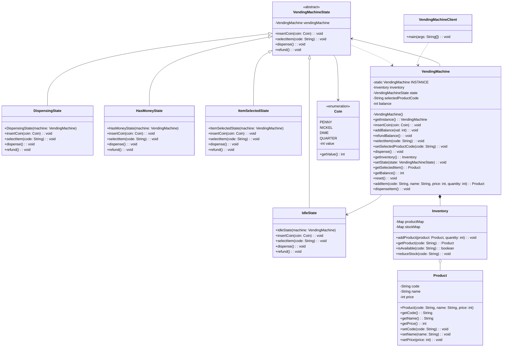

```mermaid

classDiagram
    VendingMachineState <|-- DispensingState
    VendingMachineState <|-- HasMoneyState
    VendingMachineState <|-- IdleState
    VendingMachineState <|-- ItemSelectedState
    Inventory o-- Product
    VendingMachineState ..> VendingMachine
    VendingMachineState --> Coin
    VendingMachine *-- Inventory
    VendingMachine --> VendingMachineState
    VendingMachine --> IdleState
    VendingMachineClient ..> VendingMachine
    class Product {
        -String code
        -String name
        -int price

        +Product(code: String, name: String, price: int)
        +getCode(): String
        +getName(): String
        +getPrice(): int
        +setCode(code: String): void
        +setName(name: String): void
        +setPrice(price: int): void
    }
    class Coin {
        <<enumeration>>
        PENNY
        NICKEL
        DIME
        QUARTER

        -int value
        +getValue() int
    }
    class Inventory {
        -Map<String, Product> productMap
        -Map<String, Integer> stockMap

        +addProduct(product: Product, quantity: int): void
        +getProduct(code: String): Product
        +isAvailable(code: String): boolean
        +reduceStock(code: String): void
    }
    class VendingMachineState {
        <<abstract>>
        -VendingMachine vendingMachine

        +insertCoin(coin: Coin): void
        +selectItem(code: String): void
        +dispense(): void
        +refund(): void
    }
    class DispensingState {
        +DispensingState(machine: VendingMachine)
        +insertCoin(coin: Coin): void
        +selectItem(code: String): void
        +dispense(): void
        +refund(): void
    }
    class HasMoneyState {
        +HasMoneyState(machine: VendingMachine)
        +insertCoin(coin: Coin): void
        +selectItem(code: String): void
        +dispense(): void
        +refund(): void
    }
    class IdleState {
        +IdleState(machine: VendingMachine)
        +insertCoin(coin: Coin): void
        +selectItem(code: String): void
        +dispense(): void
        +refund(): void
    }
    class ItemSelectedState {
        +ItemSelectedState(machine: VendingMachine)
        +insertCoin(coin: Coin): void
        +selectItem(code: String): void
        +dispense(): void
        +refund(): void
    }

    class VendingMachine {
        -static VendingMachine INSTANCE
        -Inventory inventory
        -VendingMachineState state
        -String selectedProductCode
        -int balance

        -VendingMachine()
        +getInstance(): VendingMachine

        +insertCoin(coin: Coin): void
        +addBalance(val: int): void
        +refundBalance(): void
        +selectItem(code: String): void
        +setSelectedProductCode(code: String): void
        +dispense(): void
        +getInventory(): Inventory
        +setState(state: VendingMachineState): void
        +getSelectedItem(): Product
        +getBalance(): int
        +reset(): void
        +addItem(code: String, name: String, price: int, quantity: int): Product
        +dispenseItem(): void
    }
    class VendingMachineClient {
        +main(args: String[]): void
    }
```